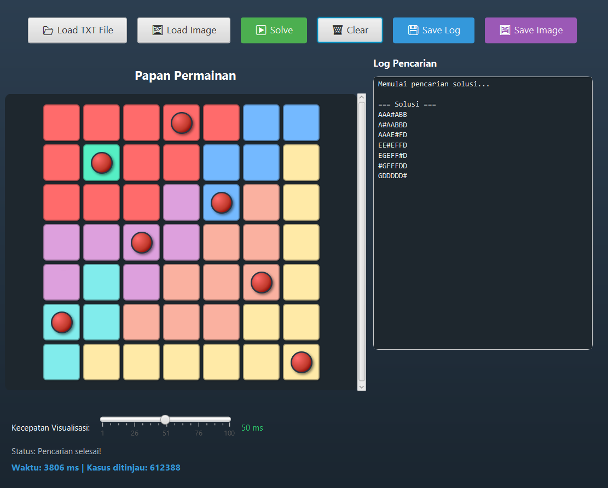

# Queens Game Solver

Program solver for the **Queens Game** puzzle from LinkedIn, built in **Java** using a **Brute Force** algorithm approach.

## Program Description

Queens Game is a puzzle where the player must place queens on an N×N board following these rules:

- Each row must contain exactly one queen
- Each column must contain exactly one queen
- Each region (colored area) must contain exactly one queen
- Queens must not be adjacent to each other (including diagonally)

This program solves the puzzle using a brute force algorithm with O(N^N) complexity, and provides a live visualization of the search process.

### Features

- **CLI Mode**: Input from text file, output to terminal
- **GUI Mode**: Graphical interface built with JavaFX
  - Input from TXT file or image (screenshot)
  - Live visualization of the brute force process
  - Export solution to TXT or image (PNG/JPG)
  - Automatic color detection from images using HSB color space

## GUI Preview



## Requirements

| Component    | Version            |
|--------------|--------------------|
| Java JDK     | 17+                |
| Apache Maven | 3.6+               |
| JavaFX       | 17.0.8 (via Maven) |

## Installation

1. Clone the repository:
   ```bash
   git clone https://github.com/username/tucil1-queens-game-simulation.git
   cd tucil1-queens-game-simulation
   ```

2. Verify Java 17+ is installed:
   ```bash
   java -version
   ```

3. Verify Maven is installed:
   ```bash
   mvn -version
   ```

## Build

Navigate to the project directory and compile:

```bash
cd project-tucil1
mvn clean compile
```

## Running the Program

### Interactive Mode (CLI/GUI Selection)

```bash
cd project-tucil1
mvn exec:java
```

The program will display a menu to select between CLI and GUI mode.

### CLI Mode

1. Select option 1 (CLI) from the menu
2. Enter the path to the test case file (e.g. `../test/test1.txt`)
3. The program will display the solution
4. Choose whether to save the result to a file

### GUI Mode

1. Select option 2 (GUI) or launch with `--gui`
2. Click **Load TXT** to input from a text file, or **Load Image** to input from a screenshot
3. For image input, adjust the grid overlay to match the board
4. Click **Solve** to run the solver
5. Use **Save TXT** or **Save Image** to export the result

## Input File Format (TXT)

```
<board_size>
<row_1>
<row_2>
...
<row_n>
```

**Example (5x5):**

```
5
AAABB
ACCCB
DCCCE
DDDEE
DDDEE
```

Each letter represents a different region.

## Project Structure

```
project-tucil1/
├── src/main/java/tucil1/aufar/
│   ├── App.java                       # Entry point
│   ├── controllers/
│   │   └── IOHandler.java             # File I/O handling
│   ├── models/
│   │   ├── BruteForce.java            # Solver algorithm
│   │   └── ColorRegionExtractor.java  # Region extraction from image
│   └── views/
│       ├── MainGUI.java               # Main GUI
│       └── ImageConfigDialog.java     # Image configuration dialog
└── pom.xml
```

## Author

| Name                        | Student ID |
|-----------------------------|------------|
| Muhammad Aufar Rizqi Kusuma | 13524061   |

**Institut Teknologi Bandung - Informatics**
Tugas Kecil 1 - IF2211 Algorithm Strategies